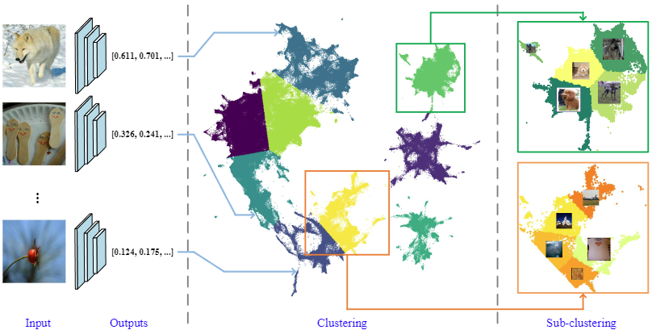

# Local Path Integration for Attribution

This code implements Local Path Integration from the following paper:

> [Local Path Integration for Attribution](https://scholar.google.com/scholar?cluster=4845895326140495709&hl=en&oi=scholarr)
>
> Peiyu Yang, Naveed Akhtar, Zeyi Wen, and Ajmal Mian

## Introduction

Path-based attributions account for the weak dependence property by choosing a reference from the local distribution of the input. We devise a method to identify the local input distribution and propose a technique to stochastically integrate the model gradients over the paths defined by the references sampled from that distribution. Our local path integration (LPI) method consistently outperforms existing path attribution techniques on deep visual models. Contributing to the ongoing search of reliable evaluation metrics for the interpretation methods, we introduce DiffID metric that uses the relative difference between insertion and deletion games to alleviate the distribution shift problem faced by existing metrics.



## Prerequisites

- python 3.9.2
- matplotlib 3.5.1
- numpy 1.21.5
- pytorch 1.12.0
- torchvision 0.13.1


## Estimate attributions with LPI

### Step 1: Preparing dataset and model.
```
dataset\IMAGENET
pretrained_models\YOUR_MODEL
```

### Step 2: Estimate dataset distribution.
```
python distribution_estimation.py -dataset ImageNet -model resnet34 -center_num 1,11 -ref_num 10,20
```

### Step 3: Estimate attributions with LPI.
```
python main.py -attr_method=LPI -model resnet34 -dataset ImageNet -metric visualize -k 5 -bg_size 20 -num_center 1
```

## Quantitatively evaluate attributions with DiffID
```
python main.py -attr_method=LPI -model resnet34 -dataset ImageNet -metric DiffID -k 5 -bg_size 20 -num_center 1
```

## Other incorporated attribution methods
- **Input Gradients** [[Paper](https://arxiv.org/pdf/1312.6034.pdf)]
- **Integrated Gradients** [[Paper](http://proceedings.mlr.press/v70/sundararajan17a/sundararajan17a.pdf)]
- **Expected Gradients** [[Paper](https://openreview.net/pdf?id=rygPm64tDH)]
- **Adversarial Gradient Integration** [[Paper](https://www.ijcai.org/proceedings/2021/0396.pdf)]

## Bibtex
If you found this work helpful for your research, please cite the following paper:
```
@artical{yang2023local,
    title={Local Path Integration for Attribution},
    author={Peiyu, Yang and Naveed, Akhtar and Zeyi, Wen and Ajmal, Mian},
    booktitle={AAAI Conference on Artificial Intelligence {AAAI}},
    year={2023}
}
```